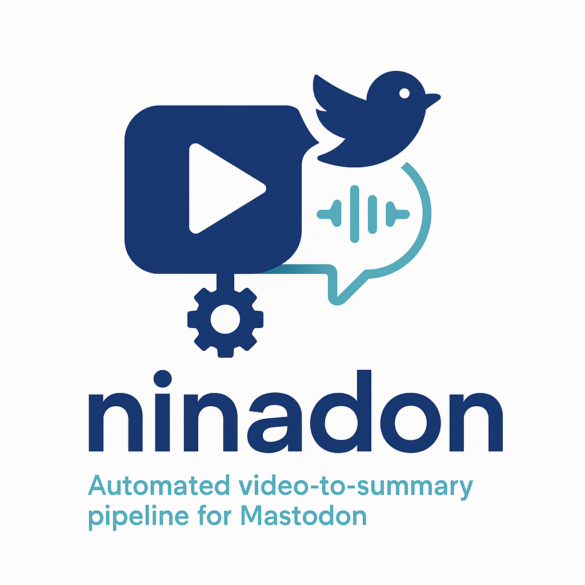

<div align="center">
  
</div>

# ninadon

Automate the workflow of downloading a video (YouTube, Instagram, TikTok), transcribing it using platform transcripts or OpenAI Whisper, summarizing with OpenRouter AI, optionally re-encoding to H.265, and posting the summary and video to Mastodon.

---

**Official Docker image for amd64 and arm64 is available at:**

```
 ghcr.io/rmoriz/ninadon
```

---

## Features

- Download videos from YouTube, Instagram, TikTok (via yt-dlp)
- Smart transcription: Uses platform-provided transcripts when available, falls back to OpenAI Whisper
- Summarize transcript with OpenRouter AI
- Optionally re-encode videos >25MB to H.265 (ffmpeg)
- Post summary and video to Mastodon
- **Enhanced analysis with `--enhance` flag:**
  - Extract still images from videos for visual analysis
  - Analyze images using OpenRouter vision models
- **Database and Context system:**
  - Automatically maintains per-user databases (`$user/database.json`)
  - Stores video metadata, transcripts, and image analysis
  - Generates contextual summaries from user history
  - Includes context in summarization for personalized content
- Cleans up temporary files automatically
- Dockerized for easy deployment
- **Modular, maintainable codebase:**
  - Repeated logic is extracted into helper functions for clarity and reuse
  - Logging is standardized with `print_flush` for consistent output
  - Environment variable access is robust and centralized

## Installation

### 1. Docker (Recommended)

You can use the prebuilt multi-arch image (amd64, arm64) from GitHub Container Registry:

```sh
docker pull ghcr.io/rmoriz/ninadon:latest
```

Or build the Docker image yourself:

```sh
docker build -t ninadon .
```

### 2. Manual (Python)

Install dependencies:

```sh
pip install -r requirements.txt
```

## Environment Variables

Set these variables before running:

- `OPENROUTER_API_KEY` — API key for OpenRouter (AI summarization)
- `AUTH_TOKEN` — Mastodon access token
- `MASTODON_URL` — Mastodon instance URL (default: `https://mastodon.social`)
- `SYSTEM_PROMPT` — (optional) Custom prompt for summarization
- `USER_PROMPT` — (optional) Custom user prompt to prepend to the transcript before summarization. If set, its contents will be merged with the transcribed text and sent to OpenRouter for summarization.
- `OPENROUTER_MODEL` — (optional) Model name for OpenRouter summarization. Defaults to `tngtech/deepseek-r1t2-chimera:free`.  
  Example: `OPENROUTER_MODEL=openai/gpt-4o`
- `ENABLE_TRANSCODING` — (optional) If set to `1`, `true`, or `yes` (case-insensitive), enables video transcoding to H.265 for files >25MB. Default: transcoding is disabled and the original video is used.
- `TRANSCODE_TIMEOUT` — (optional) Timeout in seconds for ffmpeg transcoding. Default: `600`.
- `MASTODON_MEDIA_TIMEOUT` — (optional) Timeout in seconds to wait for Mastodon to process uploaded media. Default: `600`.
- `ENHANCE_MODEL` — (optional) Model name for OpenRouter image analysis when using `--enhance` flag. Defaults to `google/gemini-2.5-flash-lite`.
- `CONTEXT_MODEL` — (optional) Model name for OpenRouter context generation from user database. Defaults to `tngtech/deepseek-r1t2-chimera:free`.
- `CONTEXT_PROMPT` — (optional) Custom prompt for context generation from user video history. Defaults to analyzing content themes, interests, and patterns.
- `IMAGE_ANALYSIS_PROMPT` — (optional) Custom prompt for image analysis when using `--enhance` flag. Defaults to `"Analyze these photos from a tiktok clip, make a connection between the photos"`.
- `DATA_PATH` — (optional) Directory path where user databases and context files are stored. Defaults to `/app/data`. For Docker, mount a volume to this path for persistence.

## Usage

### CLI

```sh
python src/main.py "https://www.youtube.com/watch?v=example"
```

### Web Application

Ninadon can also run as a web application with a simple HTML interface and RESTful API endpoints:

```sh
# Start the web server
python src/main.py --web --port 5000 --host 127.0.0.1

# With custom port and host
python src/main.py --web --port 8080 --host 0.0.0.0
```

#### Web Application Features

- **Simple HTML Interface**: Easy-to-use web form for submitting video URLs
- **RESTful API**: JSON endpoints for programmatic access
- **Basic Authentication**: Optional user/password protection
- **Async Processing**: Videos are processed in background threads
- **Job Status Tracking**: Monitor processing progress in real-time
- **Auto-refresh**: Web interface updates job status automatically

#### Web Application Environment Variables

Additional environment variables for web mode:

- `WEB_USER` — (optional) Username for basic authentication
- `WEB_PASSWORD` — (optional) Password for basic authentication

If both `WEB_USER` and `WEB_PASSWORD` are set, the web interface will require basic authentication. If not set, the web interface will be accessible without authentication (not recommended for production).

#### RESTful API Endpoints

- `GET /` — HTML interface for submitting videos
- `POST /api/process` — Submit a video for processing
- `GET /api/jobs` — List all jobs (newest first)
- `GET /api/status/<job_id>` — Get status of a specific job

#### API Examples

**Submit a video for processing:**

```bash
curl -X POST \
  -u username:password \
  -H "Content-Type: application/json" \
  -d '{"url": "https://www.youtube.com/watch?v=example", "enhance": true, "dry_run": false}' \
  http://localhost:5000/api/process
```

Response:
```json
{
  "job_id": "123e4567-e89b-12d3-a456-426614174000",
  "status": "created"
}
```

**Check job status:**

```bash
curl -u username:password http://localhost:5000/api/status/123e4567-e89b-12d3-a456-426614174000
```

Response:
```json
{
  "id": "123e4567-e89b-12d3-a456-426614174000",
  "url": "https://www.youtube.com/watch?v=example",
  "status": "completed",
  "progress": "Posted to Mastodon successfully",
  "result": {
    "title": "Example Video",
    "summary": "Video summary...",
    "mastodon_url": "https://mastodon.social/@user/123456"
  }
}
```

**List all jobs:**

```bash
curl -u username:password http://localhost:5000/api/jobs
```

#### Docker Web Application

```sh
# Run web server in Docker
docker run --rm -p 5000:5000 \
  -e OPENROUTER_API_KEY=your_openrouter_key \
  -e AUTH_TOKEN=your_mastodon_token \
  -e WEB_USER=myuser \
  -e WEB_PASSWORD=mypassword \
  -v $(pwd)/ninadon-data:/app/data \
  ghcr.io/rmoriz/ninadon:latest --web --host 0.0.0.0 --port 5000
```

Then access the web interface at `http://localhost:5000`

#### Production Deployment

For production deployment, consider:

- Using a proper WSGI server (gunicorn, uwsgi) instead of Flask's development server
- Setting up reverse proxy (nginx, Apache) for SSL termination
- Configuring proper basic authentication or integrating with your authentication system
- Setting resource limits for video processing
- Monitoring disk space for temporary files and database storage

#### Mobile App Integration

The RESTful API makes it easy to build mobile applications:

1. **Submit videos**: Use `POST /api/process` to start processing
2. **Poll status**: Use `GET /api/status/<job_id>` to check progress
3. **Authentication**: Use HTTP Basic Auth with `WEB_USER`/`WEB_PASSWORD`
4. **Error handling**: API returns proper HTTP status codes and error messages

#### Dry Run

To test the workflow without actually posting to Mastodon, use the `--dry` flag:

```sh
python src/main.py --dry "https://www.youtube.com/watch?v=example"
```

This will download, transcribe, and summarize the video, but skip the actual Mastodon post.

#### Enhanced Analysis

To enable image analysis for enhanced summarization, use the `--enhance` flag:

```sh
python src/main.py --enhance "https://www.youtube.com/watch?v=example"
```

This will extract 5 still images from the video (beginning, end, and 3 equally spaced frames), analyze them using OpenRouter's vision model, and include the image analysis in the summarization process. You can combine this with `--dry` for testing:

```sh
python src/main.py --dry --enhance "https://www.youtube.com/watch?v=example"
```

#### Database and Context System

The application automatically maintains a database for each content creator and uses it to generate contextual summaries:

**Database Storage:**
- Each user gets their own directory: `$DATA_PATH/$username/`
- Video data is stored in: `$DATA_PATH/$username/database.json`
- Context summaries are stored in: `$DATA_PATH/$username/context.json`
- Database keeps the latest 25 video entries automatically
- Data persists between runs when `DATA_PATH` is properly configured
- **Duplicate Prevention**: Re-processing the same video updates the existing entry instead of creating duplicates

**Stored Information:**
- Date and time of processing
- Video title and description
- Platform (TikTok, YouTube, Instagram)
- Extracted hashtags
- Full transcript
- Image analysis (if `--enhance` was used)

**Context Generation:**
- Before creating the Mastodon post, the system analyzes the user's video history
- Generates a context summary using OpenRouter AI, building upon previous context
- Each new context generation includes the existing context to maintain continuity
- This evolving context is included in the final summarization request
- Helps create more personalized and contextually aware summaries that improve over time

**Example workflow:**
1. Video is downloaded and processed
2. Data is added to `$username/database.json`
3. Context summary is generated from recent videos + existing context
4. Updated context summary is saved to `$username/context.json`
5. Final summary includes current video data, image analysis, and evolving context

#### Persistent Data Storage

For production use, it's important to persist user databases and context files between runs:

**Local Development:**
```sh
# Set custom data path
export DATA_PATH="./data"
python src/main.py "https://www.youtube.com/watch?v=example"
```

**Docker with Volume Mount:**
```sh
# Create a local directory for persistent data
mkdir -p ./ninadon-data

# Run with volume mount
docker run --rm \
  -e OPENROUTER_API_KEY=your_key \
  -e DATA_PATH=/app/data \
  -v $(pwd)/ninadon-data:/app/data \
  ghcr.io/rmoriz/ninadon:latest "https://www.youtube.com/watch?v=example"
```

**Docker with Named Volume:**
```sh
# Create a named volume
docker volume create ninadon-data

# Run with named volume
docker run --rm \
  -e OPENROUTER_API_KEY=your_key \
  -v ninadon-data:/app/data \
  ghcr.io/rmoriz/ninadon:latest "https://www.youtube.com/watch?v=example"
```

### Docker

Using the prebuilt image:

```sh
docker run --rm \
  -e OPENROUTER_API_KEY=your_openrouter_key \
  -e AUTH_TOKEN=your_mastodon_token \
  -e MASTODON_URL=https://mastodon.social \
  -v $(pwd)/ninadon-data:/app/data \
  ghcr.io/rmoriz/ninadon:latest "https://www.youtube.com/watch?v=example"
```

Or with your own build:

```sh
docker run --rm \
  -e OPENROUTER_API_KEY=your_openrouter_key \
  -e AUTH_TOKEN=your_mastodon_token \
  -e MASTODON_URL=https://mastodon.social \
  -v $(pwd)/ninadon-data:/app/data \
  ninadon "https://www.youtube.com/watch?v=example"
```

**Note:** The `-v $(pwd)/ninadon-data:/app/data` mount ensures that user databases and context files persist between container runs. The local `ninadon-data` directory will be created automatically.

#### Docker Dry Run

For dry run with Docker (note: AUTH_TOKEN and MASTODON_URL are not required for dry runs):

```sh
docker run --rm \
  -e OPENROUTER_API_KEY=your_openrouter_key \
  -v $(pwd)/ninadon-data:/app/data \
  ghcr.io/rmoriz/ninadon:latest --dry "https://www.youtube.com/watch?v=example"
```

#### Docker with Enhanced Analysis

To use the `--enhance` flag with Docker:

```sh
docker run --rm \
  -e OPENROUTER_API_KEY=your_openrouter_key \
  -e AUTH_TOKEN=your_mastodon_token \
  -e MASTODON_URL=https://mastodon.social \
  -e ENHANCE_MODEL=google/gemini-2.5-flash-lite \
  -v $(pwd)/ninadon-data:/app/data \
  ghcr.io/rmoriz/ninadon:latest --enhance "https://www.youtube.com/watch?v=example"
```

Or combine with dry run:

```sh
docker run --rm \
  -e OPENROUTER_API_KEY=your_openrouter_key \
  -e ENHANCE_MODEL=google/gemini-2.5-flash-lite \
  -v $(pwd)/ninadon-data:/app/data \
  ghcr.io/rmoriz/ninadon:latest --dry --enhance "https://www.youtube.com/watch?v=example"
```

#### Docker Compose

For easier management, you can use Docker Compose:

```yaml
# docker-compose.yml
version: '3.8'
services:
  ninadon:
    image: ghcr.io/rmoriz/ninadon:latest
    environment:
      - OPENROUTER_API_KEY=${OPENROUTER_API_KEY}
      - AUTH_TOKEN=${AUTH_TOKEN}
      - MASTODON_URL=${MASTODON_URL:-https://mastodon.social}
      - DATA_PATH=/app/data
      - ENHANCE_MODEL=${ENHANCE_MODEL:-google/gemini-2.5-flash-lite}
      - CONTEXT_MODEL=${CONTEXT_MODEL:-tngtech/deepseek-r1t2-chimera:free}
    volumes:
      - ninadon-data:/app/data
    command: ["--dry", "https://www.youtube.com/watch?v=example"]

volumes:
  ninadon-data:
```

Run with:
```sh
# Set environment variables
export OPENROUTER_API_KEY=your_key
export AUTH_TOKEN=your_token

# Run with Docker Compose
docker-compose run --rm ninadon "https://www.youtube.com/watch?v=example"
```

## Shell Functions

For easier usage, you can add these shell functions to your `.bashrc` or `.zshrc`:

```bash
# ninadon [args...]
ninadon() {
  # Datenverzeichnis konfigurierbar, Default: ~/.ninadon
  local data_dir="${NINADON_DATA_DIR:-$HOME/.ninadon}"
  mkdir -p "$data_dir"
  
  # Whisper-Modellverzeichnis
  local whisper_dir="${NINADON_WHISPER_DIR:-$HOME/.ninadon/whisper}"
  mkdir -p "$whisper_dir"
  
  docker run --pull=always --rm \
    -e SYSTEM_PROMPT='Verfasse für das Video einen Social-Media-Post für '\
'Mastodon auf Deutsch (Hinweis: maximal 350 Zeichen + 0–3 Hashtags, keine '\
'Zeichenangabe etc. notwendig. Ausgabe soll direkt für social media '\
'geeignet sein, KEINE Meta-Angaben (Länge, Tonalität etc) über den Text. '\
'Einfach nur den Text aussgeben). Text darf schon witzig und aktivierend '\
'sein, nicht immer alles verrachten, leute sollen durchaus neugierig '\
'gemacht werden. Beachte den Context, sofern er brauchbare Indizien '\
'liefert. Die Transkription wird sicherlich Fehler enthalten, also bitte '\
'korrigiere offensichtliche Falschbeschreibungen und Rechtschreibfehler, '\
'bevor du den Text zurücklieferst. Vielleicht steht im Context das '\
'richtige Wort/Begriff/Name. Versuche aus dem Context herauszufinden, um '\
'welche Veranstaltung/Event es sich handelt oder wo ein Bezug bestehen '\
'könnte. Möglicherweise gibt es einen Zusammenhang zu den letzten Videos, '\
'die im Context beschrieben sind? Verwende mögliche Hashtags des Videos.' \
    -e IMAGE_ANALYSIS_PROMPT="Beschreibe, was du in diesen Videoframes "\
"siehst, und erkläre die mögliche visuelle Handlung bzw. den Zusammenhang." \
    -e CONTEXT_PROMPT="Erstelle einen Context aus den folgenden Daten. Es "\
"handelt sich um diverse social media Videos eines Users in zeitlicher "\
"Reihenfolge. Erzeuge eine ausgewogene Zusammenfassung und versuche "\
"möglichst, Rechtschreibfehler und Ergebnisse falscher Sprach- und "\
"Bilderkennung heuristisch zu korrigieren oder zu ignorieren. Achte auf "\
"die Schreibweisen von Namen, Orten, Dingen." \
    -e AUTH_TOKEN="${MASTODON_AUTH_TOKEN:?Setze MASTODON_AUTH_TOKEN}" \
    -e OPENROUTER_API_KEY \
    -e OPENROUTER_MODEL \
    -e CONTEXT_MODEL="${CONTEXT_MODEL:-${OPENROUTER_MODEL}}" \
    -e ENHANCE_MODEL="${ENHANCE_MODEL:-google/gemini-2.5-flash-lite}" \
    -e MASTODON_URL="${MASTODON_URL:-https://mastodon.social}" \
    -v "${data_dir}:/app/data" \
    -v "${whisper_dir}:/app/.ninadon/whisper" \
    ghcr.io/rmoriz/ninadon:latest --enhance "$@"
    # Optional: Map file permissions correctly (Linux/macOS)
    # --user "$(id -u):$(id -g)" \
}

# Dry-Run Wrapper
dry_ninadon() {
  ninadon --dry "$@"
}

# seed_ninadon <profile-or-channel-url> [count=20]
seed_ninadon() {
  local profile_url="${1:-}"
  local count="${2:-20}"

  if [[ -z "$profile_url" ]]; then
    echo "Usage: seed_ninadon <profile-or-channel-url> [count=20]" >&2
    echo "Examples:"
    echo "  seed_ninadon https://www.tiktok.com/@nimasigg 20"
    echo "  seed_ninadon https://www.instagram.com/natgeo/ 15"
    echo "  seed_ninadon https://www.youtube.com/@veritasium 10"
    return 1
  fi

  # macOS often doesn't have 'tac'; fallback to 'tail -r'
  local REVERSE="tac"
  if ! command -v tac >/dev/null 2>&1; then
    if command -v tail >/dev/null 2>&1; then
      REVERSE="tail -r"
    else
      # portable AWK reverse as last option
      REVERSE="awk '{a[NR]=\$0} END{for(i=NR;i>0;i--) print a[i]}'"
    fi
  fi

  # yt-dlp: get first N entries and output their webpage URLs
  # -I 1:COUNT = only items 1..COUNT
  # %(webpage_url)s = the "normal" link to the clip (not the file URL)
  # --ignore-errors/--no-warnings: more robust against individual failures
  yt-dlp --ignore-errors --no-warnings -I "1:${count}" \
    --print "%(webpage_url)s" "$profile_url" \
    | eval "$REVERSE" \
    | while IFS= read -r url; do
        # Optional: only process real video pages (some heuristics)
        case "$url" in
          *tiktok.com/*/video/*|*instagram.com/p/*|*instagram.com/reel/*|\
*youtube.com/watch*\?v=*|*youtube.com/shorts/*|*youtu.be/*)
            dry_ninadon "$url"
            ;;
          *)
            # for platforms/variants that don't match patterns, execute:
            dry_ninadon "$url"
            ;;
        esac
      done
}
```

### Usage Examples:

```bash
# Set up environment variables
export MASTODON_AUTH_TOKEN="your_mastodon_token"
export OPENROUTER_API_KEY="your_openrouter_key"

# Process a single video
ninadon "https://www.youtube.com/watch?v=example"

# Dry run (no posting)
dry_ninadon "https://www.tiktok.com/@user/video/123456"

# Seed database with recent videos from a channel (dry run)
seed_ninadon "https://www.youtube.com/@veritasium" 10

# Custom data directory
export NINADON_DATA_DIR="/path/to/your/data"
ninadon "https://www.instagram.com/reel/example"
```

### Features:

- **Automatic Updates**: `--pull=always` ensures you're using the latest version
- **Persistent Data**: Uses `~/.ninadon` by default (configurable with `NINADON_DATA_DIR`)
- **German Summaries**: Pre-configured with German system prompt for Mastodon
- **Enhanced Mode**: Always uses `--enhance` for image analysis
- **Bulk Processing**: `seed_ninadon` processes multiple videos from a channel/profile
- **Cross-Platform**: Works on Linux, macOS, and Windows (with WSL)

## Example Output

### Example Mastodon Post


### Normal Run Output

```
Working in temp dir: /tmp/tmpabcd1234
Downloaded video to: /tmp/tmpabcd1234/video.mp4
Transcript:
  Pizza-Schiffchen, Puhl, alles wunderbar, wunderschönes Wett
Summary:
  A short summary of the video content...
Final video for posting: /tmp/tmpabcd1234/video_h265.mp4
Uploading video to Mastodon...
Waiting for Mastodon to process video...
Posting status to Mastodon...
Posted to Mastodon: https://mastodon.social/@youruser/123456
```

### Dry Run Output

```
Working in temp dir: /tmp/tmpabcd1234
Downloaded video to: /tmp/tmpabcd1234/video.mp4
Transcript:
  Pizza-Schiffchen, Puhl, alles wunderbar, wunderschönes Wett
Summary:
  A short summary of the video content...
Final video for posting: /tmp/tmpabcd1234/video_h265.mp4
DRY RUN: Skipping Mastodon post
Would post summary:
  A short summary of the video content...
Would post video: /tmp/tmpabcd1234/video_h265.mp4
Would include source URL: https://www.youtube.com/watch?v=example
```

## Docker Volume Mounts for Whisper Models

When using Docker, it's recommended to mount volumes for Whisper models to avoid repeated downloads and improve performance:

### Recommended Docker Mounts

```sh
# Create directories for persistent storage
mkdir -p ./ninadon-data
mkdir -p ./whisper-models

# Run with both data and whisper model mounts
docker run --rm \\
  -e OPENROUTER_API_KEY=your_openrouter_key \\
  -e AUTH_TOKEN=your_mastodon_token \\
  -e MASTODON_URL=https://mastodon.social \\
  -v $(pwd)/ninadon-data:/app/data \\
  -v $(pwd)/whisper-models:/app/.ninadon/whisper \\
  ghcr.io/rmoriz/ninadon:latest "https://www.youtube.com/watch?v=example"
```

### Why Mount Whisper Models?

- **Performance**: Avoids re-downloading Whisper models on each container run
- **Network efficiency**: Reduces bandwidth usage for repeated transcriptions
- **Faster startup**: Models are immediately available without download delays

## Troubleshooting

- **Mastodon API Error 422:** The app now waits for Mastodon to finish processing the video before posting. If you still see this error, check your Mastodon instance and try increasing the wait timeout.
- **Whisper model download:** The Docker image pre-downloads the Whisper "base" model for fast startup. If you use a different model, update the Dockerfile accordingly. Use volume mounts to persist downloaded models.
- **OpenRouter API issues:** Ensure your API key is valid and you have sufficient quota.

## Code Quality

- The codebase is modular and maintainable, with repeated logic extracted into helper functions.
- Logging is standardized using `print_flush` for consistent and immediate output.
- Environment variable access is robust and centralized via a single helper.
- All code changes are tested and must pass before commit.

## License

MIT

---

## Contributing

PRs and issues welcome!

- Please ensure all tests pass before submitting a PR.
- Follow the code style and modularity guidelines (see `AGENTS.md`).
- Refactor or extract helpers if you find repeated logic.
- Use `print_flush` for logging.

