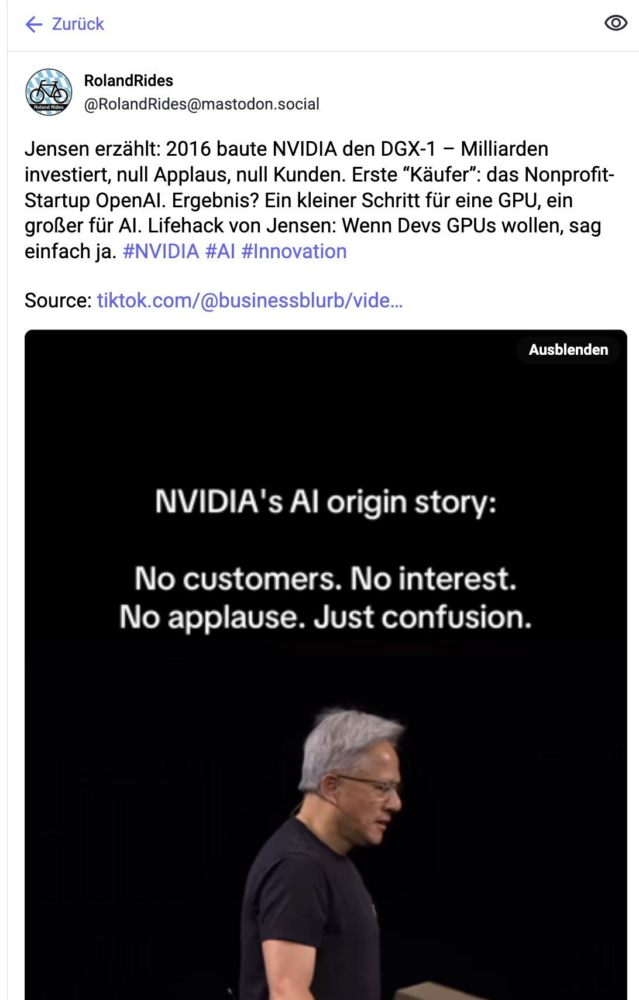

<div align="center">
  
</div>

# ninadon

Automate the workflow of downloading a video (YouTube, Instagram, TikTok), transcribing it with OpenAI Whisper, summarizing with OpenRouter AI, optionally re-encoding to H.265, and posting the summary and video to Mastodon.

---

**Official Docker image for amd64 and arm64 is available at:**

```
 ghcr.io/rmoriz/ninadon
```

---

## Features

- Download videos from YouTube, Instagram, TikTok (via yt-dlp)
- Transcribe audio using OpenAI Whisper
- Summarize transcript with OpenRouter AI
- Optionally re-encode videos >25MB to H.265 (ffmpeg)
- Post summary and video to Mastodon
- Cleans up temporary files automatically
- Dockerized for easy deployment

## Installation

### 1. Docker (Recommended)

You can use the prebuilt multi-arch image (amd64, arm64) from GitHub Container Registry:

```sh
docker pull ghcr.io/rmoriz/ninadon:latest
```

Or build the Docker image yourself:

```sh
docker build -t ninadon .
```

### 2. Manual (Python)

Install dependencies:

```sh
pip install -r requirements.txt
```

## Environment Variables

Set these variables before running:

- `OPENROUTER_API_KEY` — API key for OpenRouter (AI summarization)
- `AUTH_TOKEN` — Mastodon access token
- `MASTODON_URL` — Mastodon instance URL (default: `https://mastodon.social`)
- `SYSTEM_PROMPT` — (optional) Custom prompt for summarization

## Usage

### CLI

```sh
python src/main.py "https://www.youtube.com/watch?v=example"
```

### Docker

Using the prebuilt image:

```sh
docker run --rm \
  -e OPENROUTER_API_KEY=your_openrouter_key \
  -e AUTH_TOKEN=your_mastodon_token \
  -e MASTODON_URL=https://mastodon.social \
  ghcr.io/rmoriz/ninadon:latest "https://www.youtube.com/watch?v=example"
```

Or with your own build:

```sh
docker run --rm \
  -e OPENROUTER_API_KEY=your_openrouter_key \
  -e AUTH_TOKEN=your_mastodon_token \
  -e MASTODON_URL=https://mastodon.social \
  ninadon "https://www.youtube.com/watch?v=example"
```

## Example Output

### Example Mastodon Post



```
Working in temp dir: /tmp/tmpabcd1234
Downloaded video to: /tmp/tmpabcd1234/video.mp4
Transcript:
  Pizza-Schiffchen, Puhl, alles wunderbar, wunderschönes Wett
Summary:
  A short summary of the video content...
Final video for posting: /tmp/tmpabcd1234/video_h265.mp4
Uploading video to Mastodon...
Waiting for Mastodon to process video...
Posting status to Mastodon...
Posted to Mastodon: https://mastodon.social/@youruser/123456
```

## Troubleshooting

- **Mastodon API Error 422:** The app now waits for Mastodon to finish processing the video before posting. If you still see this error, check your Mastodon instance and try increasing the wait timeout.
- **Whisper model download:** The Docker image pre-downloads the Whisper "base" model for fast startup. If you use a different model, update the Dockerfile accordingly.
- **OpenRouter API issues:** Ensure your API key is valid and you have sufficient quota.

## License

MIT

---

## Contributing

PRs and issues welcome!
